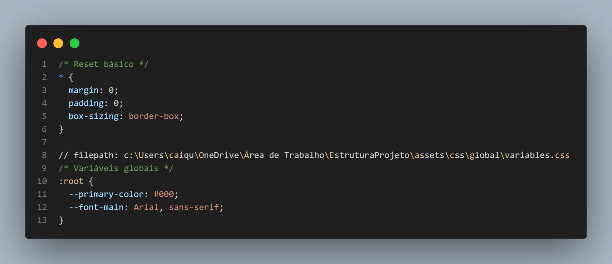

Estilos para todas as telas de seu projeto se encontra aqui.
Pelo conteúdo do arquivo readmi.md na pasta css/global, este diretório é destinado a armazenar os estilos CSS que serão aplicados globalmente em todo o projeto.

Alguns pontos importantes sobre estilos globais:

São estilos que afetam todo o projeto/aplicação
Geralmente incluem:
Reset/Normalização de CSS
Variáveis globais (cores, fontes, etc.)
Estilos base para elementos HTML
Classes utilitárias reutilizáveis
Para manter uma boa organização, recomendo separar os estilos globais em arquivos específicos como:
    

     
    
     
     
    

Isso ajuda a manter o código mais organizado e facilita a manutenção do projeto.